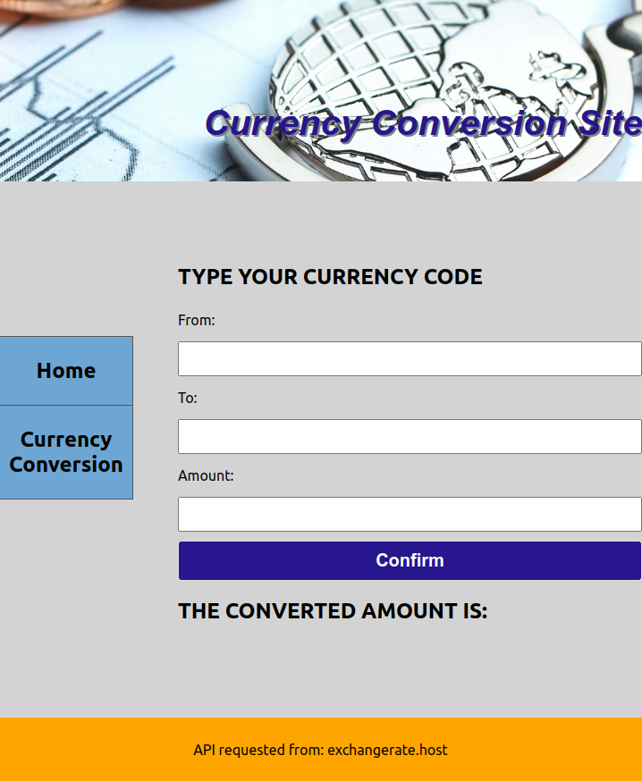

Description:

My project is about knowing the exchange rate of all the currencies all over the world. Being an immigrant, very often I have to check at the exchange rate of my home currency before making any transactions. That gave me the idea of making a website where not only you can see the exchange rate of a currency also you can calculate the amount you want to convert.

Screenshot:

Screenshot of project2.png

Technologies Used:

For my project I used React js, Css languages. For the data library I used https://exchangerate.host/#/docs sites API. For styling purposed I used references from w3schools.com site.

User Stories: - As a user, I want my website to look simple. - As a user, I want my website to have easy navigation options. - As a user, I want my website to have a homepage with a few default currency rates - As a user, I want to be able to check the rate of any currency in the world against other currencies.
Post-MVP plan: - As a user, I would like to see the trend of the conversion rate for the last few months.
Component hierarchy: - App.js(State) - Navigation.js - Home.js(Props) - Currency.js(Props) - Header.js - Footer.js

Deployed Site Link:

https://mellifluous-biscochitos-ace5e1.netlify.app/
